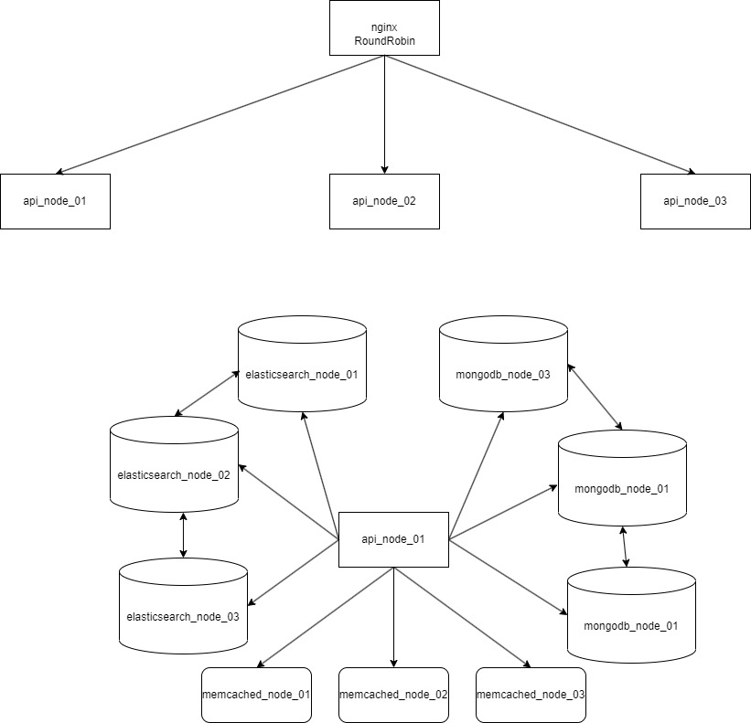

## Используемые технологии
- python в качестве основного языка программирования
- javascript для скриптов в mongodb
- fastapi для rest-api приложения
- mongodb как основное хранилище данных
- elasticsearch для полнотекстового поиска
- memcached в качестве кэширования
- docker для виртуализации
- docker-compose для оркестрации и запуска кластера
- nginx в качестве балансировщика нагрузки
- angular для клиентского приложения

## Сценарии использования:
- Сохранение информации о студенте
- Получение информации о студенте по его id
- Получение списка всех студентов
- Получение списка студентов по имени
- Удаление информации о студенте

## Конфигурация rest-api приложения
Переменные окружения по умолчанию хранятся в файле [`.env`](rest-api/src/.env).

| Переменная| Назначение                        |
| -------- |-----------------------------------|
|MONGO_URI| Строка подключения к mongodb      |
|ELASTICSEARCH_URI| Адрес elasticsearch               |
|MEMCACHED_URI| Адрес memcached                   |
|MONGO_DB| Используемая база данных mongodb  |
|MONGO_COLLECTION| Используемая коллекция mongodb    |
|ELASTICSEARCH_INDEX| Используемый индекс elasticsearch |

## Запуск rest-api приложения локально
Системные требования:
- python версии 11
- Экземпляр mongodb, запущенный на localhost:27017
- Экземпляр elasticseacrh, запущенный на localhost:9200
- Экземпляр memcached, запущенный на localhost:11211

Запуск:
```
cd .\rest-api\src
pip install -r requirements.txt
uvicorn main:app --reload --env-file .env
```

## Запуск клиентского приложения локально
Системные требования:
- nodejs версии 19
- angular версии 17
Запуск:
```
cd .\ui
npm i
npm start
```

## Запуск кластера в docker(production версия)
Системные требования:
- Запущенный демон docker на машине
- Желательно большое количество оперативной памяти(>16gb)

Запуск:
```
docker compose up --build -d
```

## Запуск кластера в docker(версия для отладки)
Отличия от production версии:
- У каждого контейнера порты проброшены на хост-машину.
- Сетевое взаимодейтсвие контейнеров происходит в хост-машине за счет использования специального dns имени - [host.docker.internal](1).
- Запускается только инфраструктурная часть(mongodb, elasticsearch, memcached).

Запуск:
```
docker compose -f ./infrastructure/local/docker-compose.yml up -d
```

Trobleshooting:

В случае возникновения в elasticsearch ошибки
```
ERROR: [1] bootstrap checks failed
[1]: max virtual memory areas vm.max_map_count [65530] is too low, increase to at least [262144]
```
Необходимо в wsl выставить переменную vm.max_map_count в необходимое значение:
```
wsl -d docker-desktop
sysctl -w vm.max_map_count=262144
```

## Архитектура кластера


[1]: https://docs.docker.com/desktop/networking/#use-cases-and-workarounds-for-all-platforms